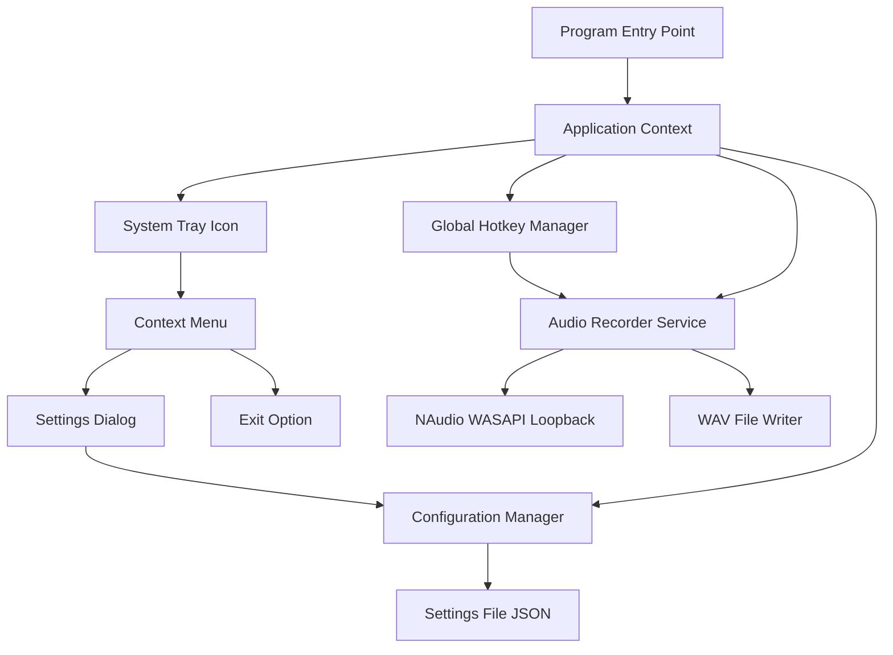

# AudioGrabber - System Tray Audio Recording Application

## Project Overview

AudioGrabber is a C# Windows application that runs in the system tray and captures all system audio (exactly as heard through headphones) when activated via a global hotkey. The application uses .NET 8 with WinForms for a lightweight, efficient implementation.

## Technical Stack

- **Framework**: .NET 8
- **UI Framework**: Windows Forms (WinForms)
- **Audio Capture**: NAudio library
- **Global Hotkey**: Windows API (user32.dll)
- **Target Platform**: Windows 10/11 (x64)

## Core Requirements

1. System tray application with minimal UI
2. Global hotkey activation (toggle recording on/off)
3. Capture system audio output (loopback recording)
4. Save recordings as WAV files (44.1kHz, 16-bit stereo)
5. Configurable output folder with timestamp-based naming
6. Visual feedback for recording state

## Architecture Overview



## Project Structure

```
AudioGrabber/
├── AudioGrabber.sln
├── AudioGrabber/
│   ├── AudioGrabber.csproj
│   ├── Program.cs
│   ├── ApplicationContext.cs
│   ├── Services/
│   │   ├── AudioRecorderService.cs
│   │   ├── GlobalHotkeyManager.cs
│   │   ├── ConfigurationManager.cs
│   │   └── RecordingLogger.cs
│   ├── Forms/
│   │   └── SettingsForm.cs
│   ├── Models/
│   │   └── AppSettings.cs
│   ├── Resources/
│   │   ├── icon_idle.ico
│   │   ├── icon_recording.ico
│   │   └── icon_error.ico
│   └── app.manifest
├── README.md
└── .gitignore
```

## Required NuGet Packages

1. **NAudio** (v2.2.1 or latest)
   - Purpose: Audio capture and WAV file writing
   - Key classes: `WasapiLoopbackCapture`, `WaveFileWriter`

2. **Newtonsoft.Json** or **System.Text.Json**
   - Purpose: Configuration file serialization
   - Recommendation: System.Text.Json (built-in to .NET 8)

## Component Specifications

### 1. Program.cs (Entry Point)

**Purpose**: Application initialization and single-instance enforcement

**Key Responsibilities**:
- Enable visual styles for WinForms
- Check for existing instance (using Mutex)
- Initialize ApplicationContext
- Set up unhandled exception handlers
- On first run, configure "Start with Windows" registry entry (default: enabled)

**Implementation Notes**:
- Use `[STAThread]` attribute
- Implement single-instance check to prevent multiple copies
- Configure high DPI awareness
- Check if first run and set up Windows startup registry entry if StartWithWindows is true

### 2. ApplicationContext.cs (Main Application Controller)

**Purpose**: Manage application lifetime and coordinate components

**Key Responsibilities**:
- Initialize and manage NotifyIcon (system tray)
- Create and wire up context menu
- Initialize services (AudioRecorder, HotkeyManager, Configuration)
- Handle application exit
- Coordinate between components
- Apply startup settings (ensure registry entry matches StartWithWindows setting)
- Implement "Remove All Settings" functionality to clean up registry and config files

**Context Menu Items**:
- Settings...
- Open Recordings Folder
- Separator
- Remove All Settings (cleans up registry and config files)
- Separator
- Exit

**State Management**:
- Track recording state
- Update tray icon color based on state:
  - Gray: Idle (not recording)
  - Red: Recording active
  - Error icon: Error state
- Visual feedback through icon color only (no popups, balloons, or menu status indicators)
- Audio feedback: Play simple beep sound when recording starts/stops using `System.Media.SystemSounds.Beep`

### 3. Services/AudioRecorderService.cs

**Purpose**: Handle all audio recording operations

**Key Responsibilities**:
- Initialize WASAPI loopback capture
- Start/stop recording
- Write audio data to WAV file
- Create and manage RecordingLogger for each session
- Log recording metadata and events
- Handle audio device changes
- Manage recording state

**Public Interface**:
```csharp
public class AudioRecorderService : IDisposable
{
    public event EventHandler<RecordingStateChangedEventArgs> StateChanged;
    public event EventHandler<RecordingErrorEventArgs> ErrorOccurred;
    
    public bool IsRecording { get; }
    public string CurrentRecordingPath { get; }
    
    public void StartRecording(string outputPath);
    public void StopRecording();
    public void Dispose();
}
```

**Implementation Details**:
- Use `WasapiLoopbackCapture` for system audio capture
- Capture format: 44.1kHz, 16-bit, stereo
- Use `WaveFileWriter` for file output
- Create `RecordingLogger` instance for each recording session
- Log file path: same as WAV file but with .log extension
- Log start/stop events, audio format, device info, and any errors
- Implement proper disposal pattern (dispose both WAV writer and logger)
- Handle device disconnection gracefully
- Buffer audio data appropriately

**Error Handling**:
- No audio devices available
- Device disconnected during recording
- Disk write errors
- Insufficient permissions

### 4. Services/GlobalHotkeyManager.cs

**Purpose**: Register and handle global keyboard shortcuts

**Key Responsibilities**:
- Register global hotkey with Windows
- Handle hotkey press events
- Unregister hotkey on cleanup
- Provide hotkey configuration

**Public Interface**:
```csharp
public class GlobalHotkeyManager : IDisposable
{
    public event EventHandler HotkeyPressed;
    
    public bool RegisterHotkey(Keys key, KeyModifiers modifiers);
    public void UnregisterHotkey();
    public void Dispose();
}

[Flags]
public enum KeyModifiers
{
    None = 0,
    Alt = 1,
    Control = 2,
    Shift = 4,
    Win = 8
}
```

**Implementation Details**:
- Use Windows API: `RegisterHotKey` and `UnregisterHotKey` from user32.dll
- Create hidden window to receive hotkey messages
- Override `WndProc` to handle `WM_HOTKEY` message
- Default hotkey: Ctrl + R (configurable via settings)
- Handle registration failures (hotkey already in use)

**P/Invoke Declarations**:
```csharp
[DllImport("user32.dll")]
private static extern bool RegisterHotKey(IntPtr hWnd, int id, uint fsModifiers, uint vk);

[DllImport("user32.dll")]
private static extern bool UnregisterHotKey(IntPtr hWnd, int id);
```

### 5. Services/ConfigurationManager.cs

**Purpose**: Manage application settings persistence

**Key Responsibilities**:
- Load settings from JSON file
- Save settings to JSON file
- Provide default settings
- Validate settings

**Public Interface**:
```csharp
public class ConfigurationManager
{
    public AppSettings Settings { get; private set; }
    
    public void LoadSettings();
    public void SaveSettings();
    public void ResetToDefaults();
}
```

**Settings File Location**:
- Path: `%APPDATA%\AudioGrabber\settings.json`
- Create directory if it doesn't exist
- Use default settings if file doesn't exist

### 6. Services/RecordingLogger.cs

**Purpose**: Manage comprehensive logging for each recording session

**Key Responsibilities**:
- Create log file alongside each recording with same name but .log extension
- Log recording session metadata (start time, end time, duration)
- Log audio format details (sample rate, bit depth, channels)
- Log system information (OS, audio device name)
- Log any warnings or errors during recording
- Flush log entries in real-time

**Public Interface**:
```csharp
public class RecordingLogger : IDisposable
{
    public void StartSession(string recordingPath, WaveFormat format);
    public void LogInfo(string message);
    public void LogWarning(string message);
    public void LogError(string message, Exception ex = null);
    public void EndSession(long bytesRecorded, TimeSpan duration);
    public void Dispose();
}
```

**Log File Format**:
```
================================================================================
AudioGrabber Recording Session Log
================================================================================
Recording File: Recording_2026-03-19_150230.wav
Session Started: 2026-03-19 15:02:30
--------------------------------------------------------------------------------

[15:02:30.123] INFO: Recording session started
[15:02:30.125] INFO: Audio Format: 44100 Hz, 16-bit, Stereo
[15:02:30.127] INFO: Audio Device: Speakers (Realtek High Definition Audio)
[15:02:30.128] INFO: Operating System: Windows 11 Pro (10.0.22621)
[15:02:30.130] INFO: Application Version: 1.0.0

[15:05:45.678] INFO: Recording session stopped
[15:05:45.680] INFO: Duration: 00:03:15.555
[15:05:45.682] INFO: Bytes Recorded: 51,891,200
[15:05:45.684] INFO: File Size: 51.89 MB

================================================================================
Session completed successfully
================================================================================
```

**Implementation Details**:
- Create log file when recording starts
- Use StreamWriter with AutoFlush enabled for real-time logging
- Include timestamps with millisecond precision
- Log audio device information from NAudio
- Log system information using Environment class
- Handle file write errors gracefully
- Close and flush log file when recording stops

### 7. Models/AppSettings.cs

**Purpose**: Define application configuration structure

**Properties**:
```csharp
public class AppSettings
{
    // Recording Settings
    public string OutputFolder { get; set; }
    public string FileNamePattern { get; set; } // e.g., "Recording_{0:yyyy-MM-dd_HHmmss}.wav"
    public int SampleRate { get; set; } // 44100
    public int BitsPerSample { get; set; } // 16
    public int Channels { get; set; } // 2 (stereo)
    
    // Hotkey Settings
    public Keys HotkeyKey { get; set; } // Keys.R
    public KeyModifiers HotkeyModifiers { get; set; } // Control | Shift
    
    // UI Settings
    public bool ShowNotifications { get; set; } // For error notifications only
    public bool StartWithWindows { get; set; } // true by default
    public bool MinimizeToTray { get; set; } // true
}
```

**Default Values**:
- OutputFolder: `%USERPROFILE%\Documents\AudioGrabber`
- FileNamePattern: `"Recording_{0:yyyy-MM-dd_HHmmss}.wav"`
- SampleRate: 44100
- BitsPerSample: 16
- Channels: 2
- HotkeyKey: Keys.R
- HotkeyModifiers: Control (Ctrl+R)
- ShowNotifications: true (for error notifications only, not for recording state changes)
- StartWithWindows: true (configurable via settings)

### 7. Forms/SettingsForm.cs

**Purpose**: Provide UI for configuration

**UI Elements**:

**Recording Settings Group**:
- Output Folder: TextBox + Browse Button
- File Name Pattern: TextBox with example preview
- Open Recordings Folder: Button

**Hotkey Settings Group**:
- Hotkey: Custom control to capture key combination (displays current: "Ctrl+R")
- Instructions label ("Press the desired key combination")
- Note: Hotkey is fully configurable by user

**General Settings Group**:
- Show notifications: CheckBox (for error notifications only)
- Start with Windows: CheckBox (default: checked)

**Buttons**:
- Save
- Cancel
- Reset to Defaults

**Implementation Notes**:
- Use FolderBrowserDialog for folder selection
- Validate hotkey isn't already in use
- Show preview of filename with current pattern
- Update registry for "Start with Windows" option when checkbox changes
- Apply settings immediately on Save
- Sync registry entry with StartWithWindows setting

### 8. Resources (Icons)

**Required Icons** (16x16 and 32x32):

1. **icon_idle.ico**: Idle state - microphone icon in gray
2. **icon_recording.ico**: Recording state - microphone icon in red
3. **icon_error.ico**: Error state - microphone icon with warning symbol

**Icon Design Guidelines**:
- Simple, recognizable at small sizes
- Clear visual distinction between states
- Professional appearance
- Match Windows 11 design language

## Implementation Steps

### Phase 1: Project Setup

1. **Create Solution and Project**
   - Create new .NET 8 Windows Forms application
   - Configure project properties (output type: WinExe)
   - Set application icon
   - Configure app.manifest for DPI awareness and admin privileges (if needed)

2. **Install NuGet Packages**
   ```bash
   dotnet add package NAudio
   ```

3. **Create Project Structure**
   - Create folders: Services, Forms, Models, Resources
   - Add placeholder files for each component

4. **Configure Build Settings**
   - Target: net8.0-windows
   - Platform: x64
   - Enable nullable reference types
   - Set language version to latest

### Phase 2: Core Services Implementation

5. **Implement ConfigurationManager**
   - Create AppSettings model
   - Implement JSON serialization/deserialization
   - Add default settings logic
   - Test settings persistence

6. **Implement RecordingLogger**
   - Create log file writer with real-time flushing
   - Implement log entry formatting with timestamps
   - Add methods for logging info, warnings, and errors
   - Implement session start/end logging with metadata
   - Test log file creation and writing

7. **Implement AudioRecorderService**
   - Set up NAudio WASAPI loopback capture
   - Implement recording start/stop logic
   - Add WAV file writing
   - Integrate RecordingLogger for each session
   - Log audio format, device info, and recording events
   - Implement event notifications
   - Add error handling with logging
   - Test with various audio scenarios

8. **Implement GlobalHotkeyManager**
   - Create hidden window for message handling
   - Implement P/Invoke declarations
   - Add hotkey registration/unregistration
   - Handle WM_HOTKEY messages
   - Test hotkey functionality

### Phase 3: UI Implementation

9. **Implement ApplicationContext**
   - Create NotifyIcon
   - Build context menu
   - Wire up event handlers
   - Implement state management with icon color changes
   - Add balloon notifications for errors only (not for recording state changes)

10. **Implement SettingsForm**
    - Design form layout
    - Add all controls
    - Implement folder browser
    - Add hotkey capture control
    - Implement validation
    - Wire up save/cancel logic
    - Add registry integration for startup

11. **Create and Add Icons**
    - Design or source icons for three states
    - Add to Resources folder
    - Configure as embedded resources
    - Test icon switching

### Phase 4: Integration and Polish

12. **Integrate All Components**
    - Wire up ApplicationContext with all services
    - Connect hotkey manager to audio recorder
    - Implement recording toggle logic
    - Add state synchronization
    - Test end-to-end workflow

13. **Add Error Handling**
    - Implement comprehensive try-catch blocks
    - Add user-friendly error messages
    - Ensure errors are logged to recording log files
    - Handle edge cases (no audio device, disk full, etc.)

14. **Implement Single Instance Check**
    - Use Mutex to prevent multiple instances
    - Show existing instance if already running
    - Test multi-launch scenarios

15. **Add Audio Feedback and Error Notifications**
    - Implement simple beep sound when recording starts
    - Implement simple beep sound when recording stops
    - Use `System.Media.SystemSounds` for beep feedback
    - Add balloon notifications for errors only
    - Make error notifications optional via settings

### Phase 5: Testing and Deployment

16. **Testing**
    - Test recording functionality with various audio sources
    - Test hotkey in different applications
    - Test settings persistence
    - Test error scenarios
    - Test on clean Windows installation
    - Verify single-instance behavior
    - Test startup with Windows
    - Verify log files are created alongside WAV files
    - Verify log files contain comprehensive session information
    - Test "Remove All Settings" functionality
    - Verify registry entry is removed after cleanup
    - Verify config files are removed after cleanup

17. **Create Installer (Optional)**
    - Consider using WiX Toolset or Inno Setup
    - Include .NET 8 runtime check
    - Add desktop shortcut option
    - Configure uninstaller

18. **Documentation**
    - Update README.md with usage instructions
    - Document hotkey configuration
    - Document log file format and location
    - Add troubleshooting section
    - Include build instructions

## Key Implementation Details

### Audio Capture with NAudio

```csharp
// Initialize loopback capture
var capture = new WasapiLoopbackCapture();

// Set up event handler for audio data
capture.DataAvailable += (s, e) =>
{
    if (waveWriter != null)
    {
        waveWriter.Write(e.Buffer, 0, e.BytesRecorded);
    }
};

// Handle recording stopped
capture.RecordingStopped += (s, e) =>
{
    waveWriter?.Dispose();
    waveWriter = null;
};

// Start recording
var outputPath = GenerateOutputPath();
waveWriter = new WaveFileWriter(outputPath, capture.WaveFormat);
capture.StartRecording();
```

### Global Hotkey Registration

```csharp
// Create hidden window
protected override void WndProc(ref Message m)
{
    const int WM_HOTKEY = 0x0312;
    
    if (m.Msg == WM_HOTKEY)
    {
        HotkeyPressed?.Invoke(this, EventArgs.Empty);
    }
    
    base.WndProc(ref m);
}

// Register hotkey
RegisterHotKey(this.Handle, HOTKEY_ID, (uint)modifiers, (uint)key);
```

### Settings Persistence

```csharp
// Save settings
var json = JsonSerializer.Serialize(settings, new JsonSerializerOptions 
{ 
    WriteIndented = true 
});
File.WriteAllText(settingsPath, json);

// Load settings
if (File.Exists(settingsPath))
{
    var json = File.ReadAllText(settingsPath);
    settings = JsonSerializer.Deserialize<AppSettings>(json);
}
```

### Start with Windows

```csharp
// Add to startup
using var key = Registry.CurrentUser.OpenSubKey(
    @"SOFTWARE\Microsoft\Windows\CurrentVersion\Run", true);
key?.SetValue("AudioGrabber", Application.ExecutablePath);

// Remove from startup
using var key = Registry.CurrentUser.OpenSubKey(
    @"SOFTWARE\Microsoft\Windows\CurrentVersion\Run", true);
key?.DeleteValue("AudioGrabber", false);
```

### Audio Feedback

```csharp
// Play beep when recording starts
private void OnRecordingStarted()
{
    System.Media.SystemSounds.Beep.Play();
    // Update icon to recording state
    notifyIcon.Icon = recordingIcon;
}

// Play beep when recording stops
private void OnRecordingStopped()
{
    System.Media.SystemSounds.Beep.Play();
    // Update icon to idle state
    notifyIcon.Icon = idleIcon;
}
```

### Remove All Settings

```csharp
// Remove all application settings and registry entries
private void RemoveAllSettings()
{
    var result = MessageBox.Show(
        "This will remove all AudioGrabber settings including:\n\n" +
        "- Configuration file\n" +
        "- Start with Windows registry entry\n" +
        "- Application data folder\n\n" +
        "The application will exit after cleanup. Continue?",
        "Remove All Settings",
        MessageBoxButtons.YesNo,
        MessageBoxIcon.Warning);
    
    if (result == DialogResult.Yes)
    {
        try
        {
            // Remove registry entry for Start with Windows
            using var key = Registry.CurrentUser.OpenSubKey(
                @"SOFTWARE\Microsoft\Windows\CurrentVersion\Run", true);
            key?.DeleteValue("AudioGrabber", false);
            
            // Remove configuration directory and all files
            var appDataPath = Path.Combine(
                Environment.GetFolderPath(Environment.SpecialFolder.ApplicationData),
                "AudioGrabber");
            
            if (Directory.Exists(appDataPath))
            {
                Directory.Delete(appDataPath, true);
            }
            
            MessageBox.Show(
                "All settings have been removed successfully.\nThe application will now exit.",
                "Settings Removed",
                MessageBoxButtons.OK,
                MessageBoxIcon.Information);
            
            Application.Exit();
        }
        catch (Exception ex)
        {
            MessageBox.Show(
                $"Error removing settings: {ex.Message}",
                "Error",
                MessageBoxButtons.OK,
                MessageBoxIcon.Error);
        }
    }
}
```

## Configuration File Example

```json
{
  "OutputFolder": "C:\\Users\\Username\\Documents\\AudioGrabber",
  "FileNamePattern": "Recording_{0:yyyy-MM-dd_HHmmss}.wav",
  "SampleRate": 44100,
  "BitsPerSample": 16,
  "Channels": 2,
  "HotkeyKey": 82,
  "HotkeyModifiers": 2,
  "ShowNotifications": true,
  "StartWithWindows": true,
  "MinimizeToTray": true
}
```

## Error Handling Strategy

### Critical Errors (Show MessageBox)
- No audio devices available on startup
- Failed to register hotkey
- Failed to initialize audio system

### Recoverable Errors (Show Notification)
- Audio device disconnected during recording
- Disk write error
- Output folder not accessible

### Silent Errors (Log Only)
- Settings file corrupted (use defaults)
- Icon file missing (use default icon)

## Testing Checklist

- [ ] Application starts and appears in system tray
- [ ] Context menu displays correctly
- [ ] Settings dialog opens and saves configuration
- [ ] Global hotkey triggers recording start
- [ ] Same hotkey stops recording
- [ ] Audio is captured correctly (verify playback)
- [ ] WAV file format is correct (44.1kHz, 16-bit, stereo)
- [ ] Files are saved with correct timestamp naming
- [ ] Beep sound plays when recording starts
- [ ] Beep sound plays when recording stops
- [ ] Error notifications appear (if enabled)
- [ ] Settings persist across application restarts
- [ ] Only one instance can run at a time
- [ ] Application exits cleanly
- [ ] Start with Windows option works
- [ ] Hotkey works in different applications
- [ ] Recording continues when switching applications
- [ ] Error handling works for missing audio device
- [ ] Error handling works for disk full scenario
- [ ] Icon changes during recording
- [ ] Open recordings folder works correctly
- [ ] Log file is created alongside WAV file with .log extension
- [ ] Log file contains session metadata (start time, end time, duration)
- [ ] Log file contains audio format details
- [ ] Log file contains system and device information
- [ ] "Remove All Settings" menu option works correctly
- [ ] Confirmation dialog appears before removing settings
- [ ] Registry entry is removed after cleanup
- [ ] Configuration files are removed after cleanup
- [ ] Application exits after successful cleanup

## Performance Considerations

1. **Memory Management**
   - Dispose audio resources properly
   - Limit buffer sizes to prevent memory buildup
   - Monitor memory usage during long recordings

2. **CPU Usage**
   - Audio capture should use minimal CPU
   - Avoid UI updates during recording
   - Use efficient file I/O

3. **Disk I/O**
   - Buffer writes to reduce disk operations
   - Ensure sufficient disk space before recording
   - Handle slow disk scenarios gracefully

## Security Considerations

1. **Permissions**
   - No admin rights required for basic operation
   - Handle permission errors gracefully
   - Validate file paths to prevent path traversal

2. **Privacy**
   - No network communication
   - No telemetry or analytics
   - All data stays local

## Future Enhancements (Out of Scope)

- Multiple audio format support (MP3, FLAC, OGG)
- Audio level visualization
- Automatic silence detection and trimming
- Cloud storage integration
- Recording history/management UI
- Audio device selection
- Scheduled recordings
- Audio quality presets
- Keyboard shortcut customization UI

## Dependencies and Prerequisites

### Development Environment
- Visual Studio 2022 (v17.8 or later) or VS Code with C# extension
- .NET 8 SDK
- Windows 10/11 for testing

### Runtime Requirements
- .NET 8 Runtime (Desktop)
- Windows 10 version 1809 or later
- Audio output device

## Build Configuration

### Debug Configuration
- Enable debug symbols
- Disable optimizations
- Include console window for debugging

### Release Configuration
- Enable optimizations
- Remove debug symbols
- No console window
- Enable ReadyToRun compilation
- Single-file deployment (optional)

## Deployment Options

### Option 1: Framework-Dependent
- Smaller file size (~500KB)
- Requires .NET 8 Runtime installed
- Faster startup

### Option 2: Self-Contained
- Larger file size (~70MB)
- No runtime installation required
- Better for distribution

### Option 3: Single-File
- Single executable
- Self-contained or framework-dependent
- Easiest distribution

**Recommendation**: Start with framework-dependent for development, consider self-contained single-file for distribution.

## Project Timeline Overview

The implementation follows a logical progression:

1. **Setup and Infrastructure** - Project creation, dependencies, structure
2. **Core Services** - Audio recording, hotkey management, configuration
3. **User Interface** - System tray, settings dialog, visual feedback
4. **Integration** - Connect all components, end-to-end testing
5. **Polish and Deploy** - Error handling, testing, documentation

## Success Criteria

The project is complete when:

1. Application runs in system tray without visible window
2. Global hotkey successfully toggles recording on/off
3. Audio is captured at specified quality (44.1kHz, 16-bit, stereo)
4. Files are saved with timestamp naming in configured folder
5. Settings can be configured and persist across sessions
6. Visual feedback (icon, notifications) works correctly
7. Application handles errors gracefully
8. Only one instance can run at a time
9. Application can be cleanly exited
10. All tests pass successfully

## Notes and Recommendations

1. **NAudio Version**: Use the latest stable version (2.2.1+) for best Windows 11 compatibility

2. **Hotkey Selection**: Ctrl+R is the default hotkey and is fully configurable via the settings dialog. Users can change it to any key combination to avoid conflicts with other applications.

3. **File Naming**: Timestamp format `yyyy-MM-dd_HHmmss` ensures files sort chronologically and are unique

4. **Error Recovery**: Always dispose audio resources in finally blocks or using statements

5. **Testing**: Test on a clean Windows VM to ensure all dependencies are included

6. **Icon Design**: Consider using a professional icon designer or icon library for polished appearance

7. **Code Organization**: Keep services loosely coupled for easier testing and maintenance

8. **Async Operations**: Consider making file I/O operations async to prevent UI blocking

9. **Logging**: Add optional file logging for troubleshooting user issues

10. **Updates**: Consider implementing a simple update check mechanism for future versions

---

**Document Version**: 1.0  
**Last Updated**: 2026-03-19  
**Target Framework**: .NET 8  
**Platform**: Windows 10/11
